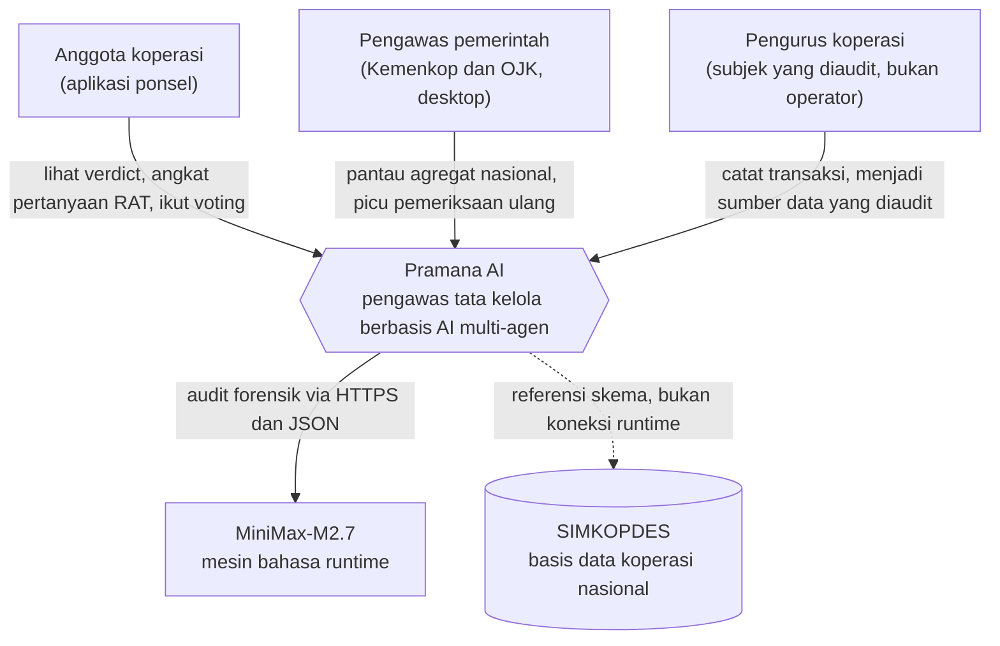
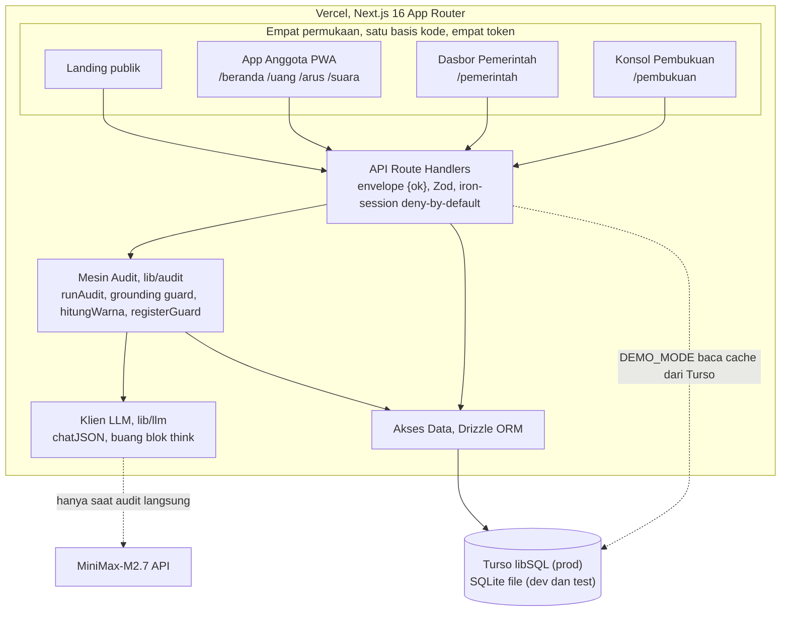
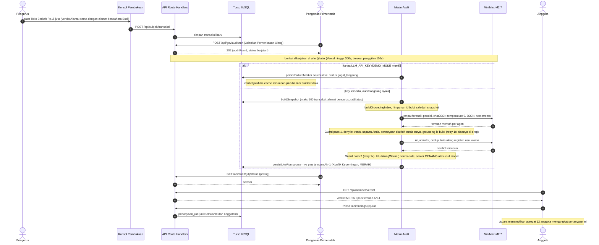
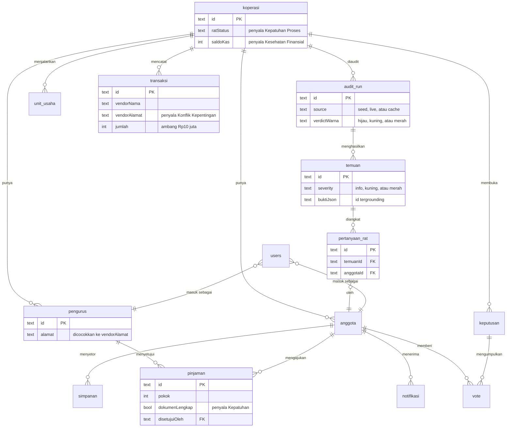
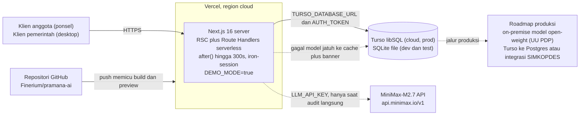

# Pramana AI

[](LICENSE) [](https://nextjs.org) [](https://pramana-ai-puce.vercel.app) [](#lisensi) [](#status-dan-verifikasi)

Sebelum koperasi desa boleh tumbuh, anggotanya harus percaya lebih dulu bahwa uang mereka aman. Pramana AI membangun kepercayaan itu: pengawas berbasis AI yang mengaudit koperasi atas nama anggotanya, bukan pengurusnya.

Pramana membaca transaksi koperasi dengan empat agen forensik yang berjalan paralel, menyatukan temuannya lewat satu adjudikator, lalu menerbitkan verdict hijau, kuning, atau merah beserta daftar pertanyaan siap pakai untuk Rapat Anggota Tahunan. Satu prinsip menaunginya dan tidak pernah dilanggar: **Pramana bertanya, tidak menuduh.** Alat pengawas yang menuduh menimbulkan risiko hukum dan meruntuhkan kepercayaan; alat yang bertanya memberdayakan anggota untuk menuntut jawaban di forum yang sah.

> **TL;DR.** Empat agen forensik plus satu adjudikator, semuanya satu model MiniMax-M2.7 yang dibedakan lewat prompt, mengubah data pembukuan koperasi menjadi verdict berbahasa awam.
> Empat permukaan dalam satu basis kode TypeScript: aplikasi anggota, dasbor pemerintah, landing publik, dan konsol pembukuan yang menjadi subjek audit.
> Empat lapis pertahanan anti-halusinasi menyaring keluaran model sebelum sampai ke pengguna: grounding bukti, warna server-side, penjaga bahasa, dan dua guard pass berpagar.
> Demo tidak pernah bergantung jaringan (DEMO_MODE dari data seed deterministik), sekaligus audit langsung ke model nyata terbukti berjalan end-to-end.

## Ringkasan produk

### Masalah yang ditangani

Program Koperasi Desa Merah Putih menggelontorkan plafon besar ke puluhan ribu koperasi baru, tetapi pengawasannya rapuh sejak akar strukturnya: pengurus mencatat sendiri pembukuannya, dan anggota, yaitu pemilik sah uang itu, tidak memiliki satu pun alat untuk memahami ke mana dananya mengalir. Ketika pengawas dan yang diawasi adalah pihak yang sama, celah penyalahgunaan menganga di sana. Pramana membalik arah pengawasan sehingga menghadap ke anggota.

Angka berikut diambil dari `lib/facts.ts`, sumber tunggal statistik nasional dalam repo ini, yang menyimpan sumber dan tanggal pada setiap nilai agar pitch tetap jujur dan pembaruan cukup di satu tempat:

| Statistik                                     | Angka     | Sumber                 | Tanggal      |
| --------------------------------------------- | --------- | ---------------------- | ------------ |
| Koperasi desa Merah Putih terbentuk           | 83.383    | Simkopdes via Katadata | 29 Juni 2026 |
| Sudah melaksanakan Rapat Anggota Tahunan      | 50.383    | Simkopdes via Katadata | 29 Juni 2026 |
| Perkiraan risiko kebocoran per unit per tahun | Rp60 juta | Studi CELIOS           | 2026         |

Selisih dua baris pertama adalah inti masalahnya: sekitar 33.000 koperasi belum melaksanakan RAT, forum tempat pengurus seharusnya mempertanggungjawabkan pengelolaan dana kepada anggota. Dengan tujuh jenis gerai resmi yang dimandatkan Inpres 9/2025 mulai beroperasi, aliran uang bertambah rumit persis ketika pengawasannya paling tipis.

### Tesis

Pertumbuhan bisnis koperasi tidak boleh mendahului kepercayaan. Jika seorang anggota belum yakin uangnya aman, penambahan gerai dan plafon hanya memperbesar taruhannya. Karena itu Pramana menjadikan **setiap anggota sebagai pengawas**: bukan dengan mengajarinya akuntansi, melainkan dengan menerjemahkan pembukuan menjadi satu verdict dan segelintir pertanyaan yang bisa ia bacakan di rapat.

### Tiga aktor, satu sistem

Pramana secara sengaja memisahkan tiga peran agar pengawasan tidak kembali jatuh ke tangan yang diawasi:

- **Anggota dilayani.** Aplikasi mobile menyajikan verdict, temuan berbahasa awam, posisi uang pribadi, arus dana koperasi, dan Suara Anda. Sasarannya tegas: dalam waktu di bawah 60 detik sejak membuka aplikasi, anggota memahami apakah koperasinya sehat dan apa yang harus ia tanyakan.
- **Pemerintah melihat agregat.** Dasbor desktop untuk Kementerian Koperasi dan pengawas menampilkan kondisi nasional, antrean koperasi yang perlu perhatian, tren, sebaran provinsi, dan kemampuan memicu pemeriksaan ulang per koperasi.
- **Pengurus adalah subjek.** Konsol Pembukuan mensimulasikan sistem pencatatan koperasi. Di sinilah data lahir, dan data inilah yang diaudit Pramana. Pengurus bukan operator aplikasi anggota; ia adalah pihak yang pembukuannya diperiksa.

Diagram konteks di bawah ini merangkum siapa berbicara kepada apa. Perhatikan bahwa SIMKOPDES digambar sebagai garis putus-putus: Pramana menyelaraskan bentuk skemanya, bukan menyambung ke runtime-nya (lihat bagian Model data dan SIMKOPDES).



## Demo

URL demo langsung: **https://pramana-ai-puce.vercel.app**

DEMO_MODE aktif secara default. Seluruh alur penjurian berjalan 100 persen dari data seed deterministik, sehingga demo tidak pernah bergantung pada jaringan atau kuota API model saat dinilai. Jalur audit langsung tetap tersedia sebagai bukti mesin nyata: bila model tidak terjangkau, hasil jatuh otomatis ke cache tersimpan disertai banner sumber data, tanpa spinner yang menggantung.

Akun uji juri sudah di-seed dan bukan rahasia; boleh dicetak:

| Peran                     | Email                      | Kata sandi           | Masuk ke    |
| ------------------------- | -------------------------- | -------------------- | ----------- |
| Juri anggota              | juri.anggota@pramana.id    | PramanaJuri2026      | /beranda    |
| Juri pemerintah           | juri.pemerintah@pramana.id | PramanaJuri2026      | /pemerintah |
| Persona anggota (Sari)    | sari@pramana.id            | SariSukamaju1        | /beranda    |
| Bendahara (konsol subjek) | bendahara@pramana.id       | PramanaBendahara2026 | /pembukuan  |

Halaman masuk memuat tombol Isi otomatis untuk setiap akun uji. Varian visual login per persona tersedia lewat `/login`, `/login?as=pemerintah`, dan `/login?as=bendahara`.

### Alur juri yang disarankan

1. Masuk sebagai **juri anggota**. Buka /beranda pada bingkai ponsel; verdict Koperasi Sukamaju berwarna **MERAH**. Baca temuan AN-1, Konflik Kepentingan, dalam bahasa awam, lalu angkat pertanyaannya ke RAT.
2. Pindah ke /suara. Lihat pertanyaan yang tadi diangkat kini masuk agregat "12 anggota mengangkat pertanyaan ini". Anggota berubah dari penonton menjadi pengawas.
3. Masuk sebagai **bendahara**. Di /pembukuan, catat transaksi baru; pohon agen pemeriksa berjalan nyata secara real-time saat Anda mengetik, memperlihatkan audit yang sesungguhnya, bukan animasi tiruan.
4. Masuk sebagai **juri pemerintah**. Di /pemerintah, ganti periode pada dropdown dan saksikan angka bergerak; pilih Sukamaju lalu picu pemeriksaan ulang untuk melihat jalur audit langsung.

## Arsitektur

Pramana adalah satu aplikasi Next.js 16 App Router yang di-deploy ke Vercel: React Server Components untuk halaman baca-berat, route handlers untuk kontrak API, dan mesin audit yang berjalan di server yang sama. Satu basis kode TypeScript melayani empat permukaan lewat empat route group, masing-masing memuat satu lapisan token desain ber-namespace sehingga register visualnya terpisah tegas tanpa menduplikasi kode.

Setiap respons API memakai envelope beku: sukses `{ok:true,data}`, gagal `{ok:false,error:{code,message}}` dengan `code` dari himpunan tertutup (UNAUTHORIZED, FORBIDDEN, NOT_FOUND, VALIDATION, LLM_UNAVAILABLE, INTERNAL). Bentuk yang seragam ini membuat setiap surface menanganinya secara sama.

### Aliran data

Pengurus menulis transaksi di konsol subjek, yang tersimpan ke basis data. Saat pemeriksaan dipicu, `buildSnapshot` menyusun potret koperasi lewat kueri SQL berbatas (maksimum 500 transaksi periode berjalan, urut tanggal, plus pinjaman aktif, daftar pengurus, dan status RAT), lalu `runAudit` menjalankan pipeline agen dan hasilnya di-persist sebagai satu `audit_run` beserta temuannya. Keempat permukaan membaca hasil itu; tidak ada surface yang memanggil model secara langsung. Kueri daftar selalu berpaginasi (maksimum 50 baris) dan agregasi dihitung di SQL, bukan dengan memuat semua baris.

### Kontrak API

Dua puluh satu route handler membentuk kontrak beku, semuanya memakai envelope yang sama:

- **Auth:** `/api/auth/login`, `/api/auth/logout`.
- **Anggota:** `/api/member/verdict`, `/api/member/findings`, `/api/member/summary`, `/api/member/flow`, `/api/member/voice`.
- **Aksi anggota:** `/api/findings/[id]/rat` (angkat pertanyaan ke RAT), `/api/vote`, `/api/onboarding`.
- **Pemerintah:** `/api/gov/overview`, `/api/gov/koperasi/[id]`, `/api/gov/audit/run` (picu audit langsung), `/api/audit/[id]/status` (polling).
- **Subjek (pengurus):** `/api/subjek/transaksi`, `/api/subjek/pinjaman`, `/api/subjek/rat`, `/api/subjek/recent`, `/api/subjek/audit`, `/api/subjek/audit/[id]`.
- **Operasional:** `/api/health`.

### DEMO_MODE dan audit latar

DEMO_MODE default membuat seluruh alur juri terbaca dari basis data. Trigger audit langsung dari dasbor pemerintah mengembalikan `202 {auditRunId, status: berjalan}` seketika, lalu pekerjaan berat dijalankan di `after()` sebagai tugas latar (aman pada Fluid Compute Vercel dengan anggaran hingga 300 detik). Panggilan model diberi timeout 110 detik; kegagalan apa pun, termasuk ketiadaan kunci API, menulis baris penanda `source=live` berstatus `gagal_langsung` sehingga verdict jatuh ke cache tersimpan plus banner. Determinisme dijaga: dua kali reseed menghasilkan keluaran byte-identik (`pnpm demo:hash`).



### Empat permukaan, satu basis kode

- **Aplikasi anggota (PWA, mobile-first).** Diport dalam bingkai iPhone saat dibuka di desktop agar juri melihat pengalaman ponsel yang sebenarnya. Menampilkan verdict, temuan, uang Anda, arus dana, dan Suara Anda, lengkap dengan bukti grounding di layar temuan.
- **Dasbor pemerintah (desktop, 12 panel).** Dropdown periode mengubah angka nyata: distribusi verdict bergerak dari Januari (9 hijau, 3 kuning, 0 merah) ke Juni (6 hijau, 4 kuning, 2 merah) di atas 12 koperasi seed lintas enam periode (72 `audit_run`). Panel mencakup KPI dengan delta dan sparkline, Kondisi Nasional, antrean Perlu Perhatian, Tren Nasional enam bulan, kartogram Sebaran Provinsi, feed Aktivitas AI Agent dari audit nyata, dan badge mesin MiniMax-M2.7.
- **Landing publik.** Wajah produk, statistik masalah dari `lib/facts.ts`, dan ajakan bertindak untuk ketiga persona.
- **Konsol Pembukuan (subjek).** Mensimulasikan pencatatan koperasi. Saat bendahara mencatat transaksi, pohon agen pemeriksa berjalan nyata secara real-time (debounce, bukan mock), memperlihatkan proses audit yang sesungguhnya.

### Struktur folder

```
app/(publik)     landing, login, daftar
app/(member)     beranda, uang, arus, suara, profil   (bingkai iPhone di desktop)
app/(gov)        pemerintah, pemerintah/koperasi/[id] (dasbor 12 panel)
app/(subjek)     pembukuan (konsol simulasi, pohon audit real-time)
app/api          route handlers (kontrak API, envelope {ok})
lib/contracts    tipe domain (Zod), sumber tunggal
lib/llm          klien model, chatJSON, ekstrakJson (buang blok think dan fence)
lib/audit        orkestrasi runAudit, snapshot, grounding, aturan warna, persist
lib/prompts      prompt Bahasa Indonesia per agen
lib/registerGuard validator bahasa sebelum persist
lib/simkopdes    lapisan display-ref format identifier SIMKOPDES
lib/copy         seluruh string UI terpusat
lib/facts        angka nasional dengan sumber dan tanggal
db               skema Drizzle, klien libSQL
scripts/seed     seed deterministik idempoten + precompute audit
styles/tokens    empat lapisan token desain per permukaan
```

## Cara kerja

Ikuti satu temuan dari lahir sampai jadi tindakan, memakai data seed Koperasi Sukamaju.

Bendahara Koperasi Sukamaju mencatat pembelian sembako dari **Toko Berkah senilai Rp15 juta**. Yang tidak ia soroti: alamat vendor pada transaksi itu **sama dengan alamat rumah bendahara Budi**. Di pembukuan biasa, baris ini tenggelam di antara ratusan transaksi lain.

Ketika audit berjalan, keempat agen forensik membaca snapshot yang sama secara paralel. Agen **Konflik Kepentingan** mencocokkan `vendorAlamat` setiap pembelian terhadap alamat setiap pengurus, menemukan kecocokan pada trx-an1, dan karena nilainya melampaui ambang Rp10 juta, menandainya **merah**. Adjudikator menghapus duplikasi, menulis ulang bahasa agar bisa dipahami awam, dan mengurutkan temuan. Server, bukan model, menghitung warna verdict dari severity temuan final; karena ada satu temuan merah, verdict koperasi menjadi **MERAH**.

Sari, seorang anggota, membuka aplikasi di ponselnya. Ia tidak melihat istilah akuntansi. Ia melihat verdict merah dan satu temuan yang berbunyi kira-kira: koperasi membeli barang dari toko yang beralamat sama dengan salah satu pengurus, dan itu perlu dijelaskan. Di bawahnya ada pertanyaan siap pakai yang berakhir dengan tanda tanya, dirancang untuk dibacakan di rapat. Sari menekan satu tombol untuk mengangkat pertanyaan itu ke RAT. Ketika 12 anggota melakukan hal yang sama, halaman Suara menampilkan "12 anggota mengangkat pertanyaan ini". Temuan mesin kini menjadi tuntutan kolektif yang harus dijawab pengurus di forum resmi. Itulah mekanisme anti-korupsinya: bukan vonis, melainkan pertanyaan yang tidak bisa diabaikan.

Diagram berikut memperlihatkan pipeline penuh, termasuk cabang latar `after()` dan titik tempat guard menyaring keluaran model.



## Agentic dan anti-halusinasi

Ini adalah jantung Pramana. Sebuah alat pengawas yang mengarang bukti lebih berbahaya daripada tidak ada alat sama sekali, karena ia mencemarkan nama baik orang atas dasar fiksi. Maka arsitektur agentik Pramana dibangun dengan asumsi bahwa model bisa salah, dan setiap keluaran model harus melewati pagar server sebelum dipercaya.

### Empat agen dan satu adjudikator, satu model

Keempat agen forensik dan adjudikator dijalankan oleh **satu** model runtime, MiniMax-M2.7 lewat endpoint OpenAI-compatible, dan dibedakan **lewat prompt, bukan model berbeda**. Keempat forensik berjalan paralel dengan `Promise.allSettled` sehingga kegagalan satu agen tidak menjatuhkan yang lain; adjudikator berjalan setelahnya di atas temuan yang sudah tervalidasi. Panggilan bersifat non-streaming agar blok penalaran `<think>` model tidak bocor ke keluaran kontrak yang wajib JSON murni.

| Agen                | Wilayah deteksi                                                                                                                                                                                          | Ambang penting                                                                                    |
| ------------------- | -------------------------------------------------------------------------------------------------------------------------------------------------------------------------------------------------------- | ------------------------------------------------------------------------------------------------- |
| Konflik Kepentingan | Cocokkan `vendorAlamat` dan `vendorNama` transaksi pembelian ke alamat dan nama pengurus; tandai pembayaran berulang ke pihak terhubung                                                                  | Merah bila nilai mencapai Rp10 juta atau lebih, atau bila polanya berulang                        |
| Anomali Transaksi   | Frekuensi persetujuan pinjaman terhadap kebiasaan; pemecahan nilai (tiga pembelian atau lebih ke vendor sama, masing-masing di bawah Rp5 juta, dalam tujuh hari); pembelian besar tak terkait unit usaha | Merah sesuai pola pemecahan atau lonjakan                                                         |
| Kesehatan Finansial | Tren saldo kas tiga periode; porsi pinjaman lewat jatuh tempo; dijelaskan dengan analogi rumah tangga tanpa istilah rasio teknis                                                                         | Turun 30 persen atau lebih kuning; 50 persen atau lebih merah                                     |
| Kepatuhan Proses    | Pinjaman `dokumenLengkap=false`; pinjaman melebihi plafon per anggota; persetujuan oleh jabatan yang bukan pemutus; status RAT                                                                           | Merah untuk pelanggaran proses; RAT belum terlaksana info atau kuning bila lewat batas tahun buku |

### Empat lapis pertahanan anti-halusinasi

**Lapis 1, grounding bukti (`lib/audit/grounding.ts`).** Setiap bukti temuan berjenis `transaksi` atau `pinjaman` wajib menunjuk id baris yang benar-benar ada di snapshot yang diberikan ke model. `buildGroundingIndex` menyusun himpunan id sah; `periksaGrounding` menolak temuan yang mengarang id. Bila model berhalusinasi bukti, temuan itu di-drop dan tidak pernah sampai ke pengguna. Bukti turunan seperti rasio dan jadwal tidak dicek terhadap himpunan id karena bukan baris basis data.

**Lapis 2, warna verdict server-side (`lib/audit/verdict.ts`).** Fungsi `hitungWarna` menurunkan warna dari severity himpunan temuan **final**: ada satu temuan merah maka merah; ada kuning tanpa merah maka kuning; selain itu hijau. Usulan warna dari adjudikator hanya masukan yang dicatat sebagai metadata; **server selalu menang** (AC-LLM-03). Model tidak pernah bisa mewarnai koperasi lebih hijau atau lebih merah daripada yang dibenarkan temuannya sendiri.

**Lapis 3, penjaga bahasa (`lib/registerGuard.ts`).** Prinsip "bertanya, bukan menuduh" ditegakkan mesin. Denylist kata vonis (korupsi, mencuri, maling, penipuan, menggelapkan, pelaku) dicek sebagai kata utuh; hanya pola edukatif ("disebut ..." atau "berisiko ...") yang diizinkan, maksimum satu kali. `pertanyaan_rat` wajib kalimat tanya yang diakhiri tanda tanya. Em dash, emoji, dan sapaan informal selain "Anda" ditolak lintas semua field. Ini juga perisai hukum: mencegah defamasi otomatis.

**Lapis 4, dua guard pass berpagar (`lib/audit/index.ts`).** Guard pass 1 memeriksa temuan tiap agen sebelum adjudikator (register plus grounding); guard pass 2 memeriksa hasil tulis ulang adjudikator dan ringkasannya sebelum persist. Tiap pass memberi model **tepat satu** retry korektif; bila pelanggaran bertahan, temuan di-drop, bukan dibiarkan lolos. Tidak ada retry tak berbatas yang bisa menggantung demo.

<details>
<summary>Contoh konkret: satu temuan lolos grounding, satu di-drop</summary>

Model mengembalikan dua temuan. Yang pertama menunjuk `trx-an1`, id yang benar-benar ada di snapshot, sehingga lolos. Yang kedua menunjuk `trx-9999`, id yang tidak ada di snapshot, sehingga `periksaGrounding` menolaknya dan temuan itu tidak pernah sampai ke anggota.

```json
{
  "temuan": [
    {
      "agent": "konflik_kepentingan",
      "severity": "merah",
      "judul": "Pembelian ke toko yang beralamat sama dengan pengurus",
      "pertanyaan_rat": "Mengapa koperasi membeli dari Toko Berkah yang beralamat sama dengan bendahara?",
      "bukti": [
        {
          "jenis": "transaksi",
          "id": "trx-an1",
          "label": "Toko Berkah Rp15 juta"
        }
      ]
    },
    {
      "agent": "anomali_transaksi",
      "severity": "merah",
      "judul": "Transaksi besar tanpa dokumen pendukung",
      "pertanyaan_rat": "Ke mana dana transaksi ini disalurkan?",
      "bukti": [
        { "jenis": "transaksi", "id": "trx-9999", "label": "id yang tidak ada" }
      ]
    }
  ]
}
```

Hasil: temuan pertama diterima; temuan kedua di-drop karena `trx-9999` tidak ada di `buildGroundingIndex`. Anggota hanya melihat yang terbukti oleh data koperasinya sendiri.

</details>

### Reproducibility dan mode gagal

Audit dirancang deterministik dan aman gagal: `temperature: 0`, keluaran divalidasi skema Zod, maksimum satu retry korektif per panggilan, lalu `LLMUnavailable`. **Tidak ada provider fallback**; jaring pengaman satu-satunya adalah cache hasil audit di basis data. Satu provider berarti satu kontrak error, satu jalur billing, satu permukaan rahasia, dan mode gagal yang mudah dipahami. Klien `ekstrakJson` membuang blok `<think>` dan code fence sebelum parsing, sehingga keluaran model M-series terbaca bersih; tanpa pembersihan ini audit langsung akan selalu terjatuh ke cache.

## Pilihan teknologi

Setiap keputusan diuji terhadap alternatif yang material, bukan sekadar dikutip. Konstrain yang menimbang semuanya: empat bundle desain ber-token yang wajib diport setia, satu basis kode untuk empat permukaan, demo dinilai dari URL live dengan jaringan venue yang tak bisa diandalkan, dan landasan waktu yang pendek.

| Keputusan                                       | Alasan                                                                                                                                                                                                                                | Alternatif yang ditolak                                                                                                                           |
| ----------------------------------------------- | ------------------------------------------------------------------------------------------------------------------------------------------------------------------------------------------------------------------------------------- | ------------------------------------------------------------------------------------------------------------------------------------------------- |
| Satu bahasa TypeScript                          | Jantung produk adalah antarmuka; empat bundle desain berbentuk komponen React ber-token, dan kebutuhan LLM tipis, hanya lima panggilan HTTP dengan validasi JSON. Satu tipe domain (Zod) dipakai UI, API, mesin audit, seed, dan test | Python plus FastAPI (praktis menjadi dua aplikasi, dua deploy, dua kontrak yang bisa hanyut); Go (ekosistem UI tak bisa mengonsumsi bundle React) |
| "Mobile" adalah web responsif ber-bingkai       | Satu basis kode melayani empat permukaan; aplikasi anggota PWA installable, ditampilkan dalam bingkai iPhone di desktop                                                                                                               | Flutter atau React Native (basis kode kedua, porting bundle desain dua kali)                                                                      |
| libSQL, Turso di prod dan SQLite di dev         | Filesystem Vercel ephemeral sehingga SQLite murni tak persist; file SQLite lokal membuat seluruh test dan seed berjalan tanpa jaringan; portabel ke Postgres tanpa mengubah kode Drizzle                                              | Postgres (butuh server atau Docker di dev dan test, tanpa kebutuhan fungsional yang menuntutnya); Prisma (lebih berat di serverless)              |
| Satu model, satu provider, tanpa framework agen | Nilai ada di desain prompt dan validasi, bukan keragaman model; kebutuhan riil selesai dengan satu klien tipis                                                                                                                        | Multi-provider fallback (menggandakan kontrak, rahasia, dan mode gagal); LangChain dan sejenisnya (abstraksi berlebih untuk lima panggilan HTTP)  |
| DEMO_MODE default true                          | Demo yang tidak pernah gagal adalah fitur; byte-identik antar-run, reset di bawah 60 detik, utuh dengan API key dikosongkan                                                                                                           | Selalu live saat demo (menaruh nasib demo pada jaringan venue dan uptime provider)                                                                |

Biaya yang diterima secara sadar dicatat jujur: keterikatan pada platform Vercel untuk hosting, diterima karena `next build` tetap jalan di Node server mana pun. Uraian lengkap dengan alasan penolakan ada di [docs/keputusan-teknis.md](docs/keputusan-teknis.md).

## Model data dan SIMKOPDES

Skema basis data mengikuti 14 tabel dengan nama tabel dan kolom yang beku, foreign key aktif, indeks eksplisit pada jalur query panas, dan constraint UNIQUE yang sekaligus menjadi penegak idempotensi: `vote(keputusanId, anggotaId)` dan `pertanyaan_rat(temuanId, anggotaId)` mencegah suara atau pertanyaan ganda di lapisan data.

Diagram berikut menyorot jalur audit, yaitu `koperasi -> audit_run -> temuan -> pertanyaan_rat`, dan hanya menampilkan kolom yang menyalakan forensik agar tetap terbaca.



### TERPASANG melawan TARGET

Panitia menegaskan koneksi langsung ke basis data bersama tidak diwajibkan. Pramana mengadopsi **bentuk** skema SIMKOPDES dan menyimpan datanya di Turso. Alignment-nya jujur dan terukur, memisahkan yang sudah terpasang di kode dari yang bersifat target integrasi.

Yang **TERPASANG** hari ini adalah lapisan display-ref deterministik di `lib/simkopdes.ts` (teruji sembilan kasus), yang memproyeksikan primary key internal ke bentuk identifier resmi tanpa mengubah PK:

| Bidang SIMKOPDES                   | PK internal          | Display-ref        |
| ---------------------------------- | -------------------- | ------------------ |
| `koperasi_ref` (KOP- plus 12 hex)  | `kop-sukamaju`       | `KOP-DEB181483DE2` |
| `anggota_ref` (16 hex)             | `ang-sari`           | `C0F48E21A9113F1B` |
| `pengurus_ref` (16 hex)            | `png-budi`           | `0CB3E2C306E538B7` |
| `nik` tersamarkan                  | `3201456789012301`   | `32************01` |
| `kode_wilayah` (kode BPS provinsi) | Sukamaju, Jawa Barat | `32.11.22.1439`    |

Yang bersifat **TARGET** dicatat apa adanya: status keanggotaan granular, tahap RAT bertingkat, dan rekening bank belum ada di skema dan disebut sebagai pekerjaan integrasi, bukan diklaim terpasang. Kuncinya: saat integrasi produksi tiba, Pramana tinggal mengarahkan primary key ke ref SIMKOPDES asli, bukan menulis ulang model data. Pemetaan tabel demi tabel ada di [docs/pemetaan-simkopdes.md](docs/pemetaan-simkopdes.md).

## Keamanan dan privasi

Format berikut menjawab pertanyaan juri langsung dengan bukti yang bisa ditunjuk, bukan janji.

| Pertanyaan         | Jawaban                                                                                                                       | Bukti                                                        |
| ------------------ | ----------------------------------------------------------------------------------------------------------------------------- | ------------------------------------------------------------ |
| Data saat transit? | TLS ujung ke ujung; seluruh trafik klien, Vercel, dan Turso melalui HTTPS                                                     | Deploy Vercel dan koneksi Turso                              |
| Data saat diam?    | Disimpan di Turso (libSQL) terkelola di cloud; on-premise adalah roadmap kepatuhan                                            | `db/client.ts`, env                                          |
| Kontrol akses?     | RBAC deny-by-default: tanpa sesi menjadi 401, role salah menjadi 403, di setiap route non-publik                              | `lib/auth.ts` (`requireRole`)                                |
| Anti-IDOR?         | Scope koperasi diikat ke sesi; anggota lintas-koperasi ditolak pada form                                                      | `lib/auth.ts` (`anggotaMilikKoperasi`, `koperasiForAnggota`) |
| Data pribadi?      | Nol PII nyata; seluruh data sintetis, NIK fiktif dan ditampilkan tersamarkan                                                  | `lib/simkopdes.ts` (`maskNik`), seed                         |
| Sesi dan sandi?    | iron-session httpOnly, secure di produksi, sameSite lax, umur 7 hari; sandi bcrypt; rate limit login                          | `lib/auth.ts`                                                |
| Rahasia?           | Hanya lewat environment; .env di-deny-read dan tak ikut deploy; SESSION_SECRET fail-fast; pindai rahasia mencakup riwayat git | `pnpm scan-secrets`                                          |
| Kerentanan?        | Nol high atau critical; satu moderate (postcss) hanya pada jalur build, bukan runtime yang menerima input pengguna            | `pnpm audit`                                                 |

Validasi Zod diterapkan di seluruh boundary input, dan SESSION_SECRET ditegakkan fail-fast pada pemakaian pertama sehingga produksi tidak pernah menandatangani sesi dengan secret kosong atau kurang dari 32 karakter.



## Perlindungan anonimitas Suara Anda

Fitur Suara Anda menampilkan hasil agregat, misalnya "12 anggota mengangkat pertanyaan ini", bukan daftar nama yang memilih. Perlindungan anonimitasnya berasal dari **desain akses**, dan kami menyatakan batasnya secara jujur.

- **Yang dijamin.** Pengurus tidak memiliki panel manajemen yang bisa menelusuri siapa memilih apa; panel semacam itu berada di luar lingkup produk secara sengaja. Antarmuka hanya merender agregat. Constraint UNIQUE pada `vote(keputusanId, anggotaId)` dan `pertanyaan_rat(temuanId, anggotaId)` mencegah suara ganda sekaligus menjadi penegak idempotensi.
- **Yang tidak diklaim.** `anggotaId` tetap tersimpan di basis data untuk mencegah suara dobel, sehingga anonimitas di sini bersifat anonimitas pada **tampilan dan akses**, bukan penghapusan identitas dari basis data. Kami tidak mengklaim anonimitas kriptografis.
- **Penguatan ke depan.** Deployment on-premise dan pengawas independen akan memperkuat jaminan ini. Perilaku agregasi anonim dikunci oleh test agar tidak diam-diam berubah.

## Menjalankan secara lokal

Prasyarat: Node.js 20 ke atas dan pnpm. Tanpa variabel TURSO, aplikasi memakai file SQLite lokal sehingga seluruh test dan seed berjalan tanpa jaringan.

```bash
# 1. Salin environment
cp .env.example .env        # dev tanpa TURSO memakai SQLite file lokal ./dev.db
# isi SESSION_SECRET minimal 32 karakter acak

# 2. Pasang dependency
pnpm install

# 3. Seed data demo (deterministik, idempoten)
pnpm seed

# 4. Jalankan
pnpm dev                    # http://localhost:3000
```

Untuk build produksi lokal: `pnpm build` lalu `pnpm start`.

## Perintah

```bash
pnpm dev            # server pengembangan
pnpm build          # build produksi
pnpm start          # jalankan build produksi
pnpm typecheck      # tsc --noEmit
pnpm lint           # eslint dan prettier
pnpm test           # vitest (unit dan integrasi) dengan coverage
pnpm e2e            # playwright (journey, mock LLM deterministik)
pnpm seed           # seed data demo
pnpm seed:verify    # checksum dan timing seed
pnpm demo:hash      # bukti determinisme (dua run, hash sama)
pnpm audit:bench    # bench latensi audit langsung
pnpm deck:build     # render pitch deck Marp ke PDF
pnpm check-register # penegakan register bahasa 6.8
pnpm scan-secrets   # pindai rahasia (tree dan riwayat git)
pnpm check-readme   # verifikasi struktur README
pnpm ci:clean       # verifikasi checkout bersih end-to-end
```

## Status dan verifikasi

Setiap klaim di bawah ini punya perintah atau berkas bukti.

- **Uji unit dan integrasi: 394 dari 394 lulus** di 38 berkas (`pnpm test`), mencakup aturan warna, grounding, register guard, pipeline audit, dan kontrak route.
- **End-to-end: 19 dari 19 lulus** (`pnpm e2e`), menempuh alur juri inti lintas empat permukaan dengan mock model deterministik.
- **Determinisme: byte-identik.** `pnpm seed:verify` memastikan seed idempoten dan `pnpm demo:hash` membuktikan dua run menghasilkan hash sama.
- **Audit langsung: nyata.** Pipeline berjalan end-to-end ke MiniMax-M2.7 dan menghasilkan verdict merah baru dengan temuan AN-1 (Konflik Kepentingan, Toko Berkah beralamat sama dengan bendahara Budi). Latensinya adalah round-trip model sungguhan, terukur pada kisaran sekitar 79 sampai 180 detik bergantung beban, dan karena itu dikerjakan di latar `after()` dengan verdict yang tetap tersedia dari cache selama proses berjalan.
- **Performa:** first-load JS sekitar 157,6 kB; p95 API terukur di bawah 3 milidetik.
- **Keamanan:** audit dependency melaporkan nol high dan nol critical; satu moderate pada postcss hanya menyentuh jalur build.

Kejujuran soal batas: [Report.md](Report.md) mendokumentasikan run otonom pertama, ketika audit langsung sempat konsisten jatuh ke cache. Dua akar penyebabnya sudah diperbaiki sejak itu: `chatJSON` kini membuang blok `<think>` dan code fence sebelum parsing, dan timeout panggilan dinaikkan dari 30 detik ke 110 detik agar cukup untuk round-trip model. Dengan kedua perbaikan itu, audit langsung kini menghasilkan verdict model baru secara end-to-end, dan status yang berlaku adalah yang dinyatakan di bagian ini.

## Keputusan teknis

Ringkasnya: satu bahasa karena jantung produk adalah antarmuka yang diport dari empat bundle desain; libSQL/Turso karena filesystem serverless ephemeral dan dev serta test bebas jaringan; satu model satu provider karena nilai ada di desain prompt bukan keragaman model; DEMO_MODE default karena demo yang tidak pernah gagal adalah fitur. Setiap keputusan diuji terhadap alternatif material (Python/FastAPI, Go, Postgres, multi-provider) dan dapat dipertahankan di hadapan juri. Uraian lengkap ada di [docs/keputusan-teknis.md](docs/keputusan-teknis.md), dan kontrak beku ada di [blueprint-pramana-ai.md](blueprint-pramana-ai.md) section 6.

## Roadmap

- **On-premise untuk kepatuhan UU PDP.** Menjalankan model open-weight di infrastruktur pemerintah sehingga data koperasi tidak keluar dari kendali negara. Klien LLM sudah OpenAI-compatible, jadi penggantian endpoint bersifat konfigurasi.
- **Integrasi SIMKOPDES produksi.** Mengarahkan primary key internal ke ref SIMKOPDES asli; kontrak format identifier sudah dipenuhi hari ini oleh lapisan display-ref.
- **Skala basis data.** Migrasi Turso ke Postgres bila volume produksi menuntutnya; skema Drizzle mendukung keduanya.
- **Perluasan tipologi.** Menambah agen forensik untuk pola penyalahgunaan baru seiring gerai KDMP beroperasi.

## Disclosure AI

Gagasan inti Pramana AI adalah karya orisinal **Tim Daulat**, yaitu Ghaisan Khoirul Badruzaman dan Kemal Ardian dari Politeknik Negeri Bandung, dan terdokumentasi sebelum pembangunan. Produk ini dikembangkan untuk Hackathon Digital Cooperatives Expo 2026, Kementerian Koperasi RI bekerja sama dengan PEBS FEB UI.

AI generatif dipakai sebagai alat, bukan sebagai penggagas. Claude Opus 4.8 via Claude Code menjadi alat implementasi untuk menulis kode, debugging, dan dokumentasi; MiniMax-M2.7 menjadi mesin runtime produk yang menjalankan agen pemeriksa saat aplikasi berjalan. Pernyataan lengkap ada di [DISCLOSURE-AI.md](DISCLOSURE-AI.md), dan rincian per tahap ada di [.crown/ai-usage.md](.crown/ai-usage.md).

## Lisensi

MIT. Lihat [LICENSE](LICENSE). Seluruh data dalam repositori ini bersifat sintetis; tidak ada data pribadi nyata.
