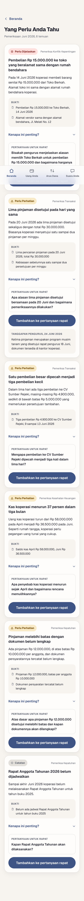
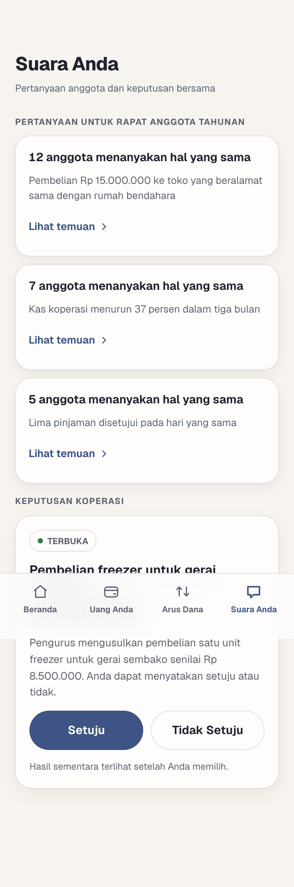
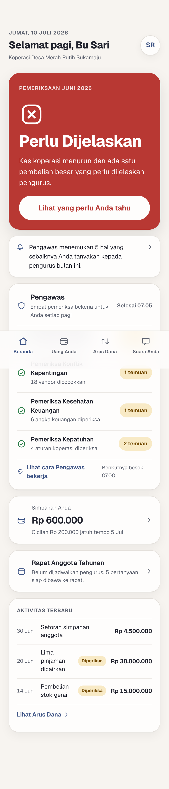
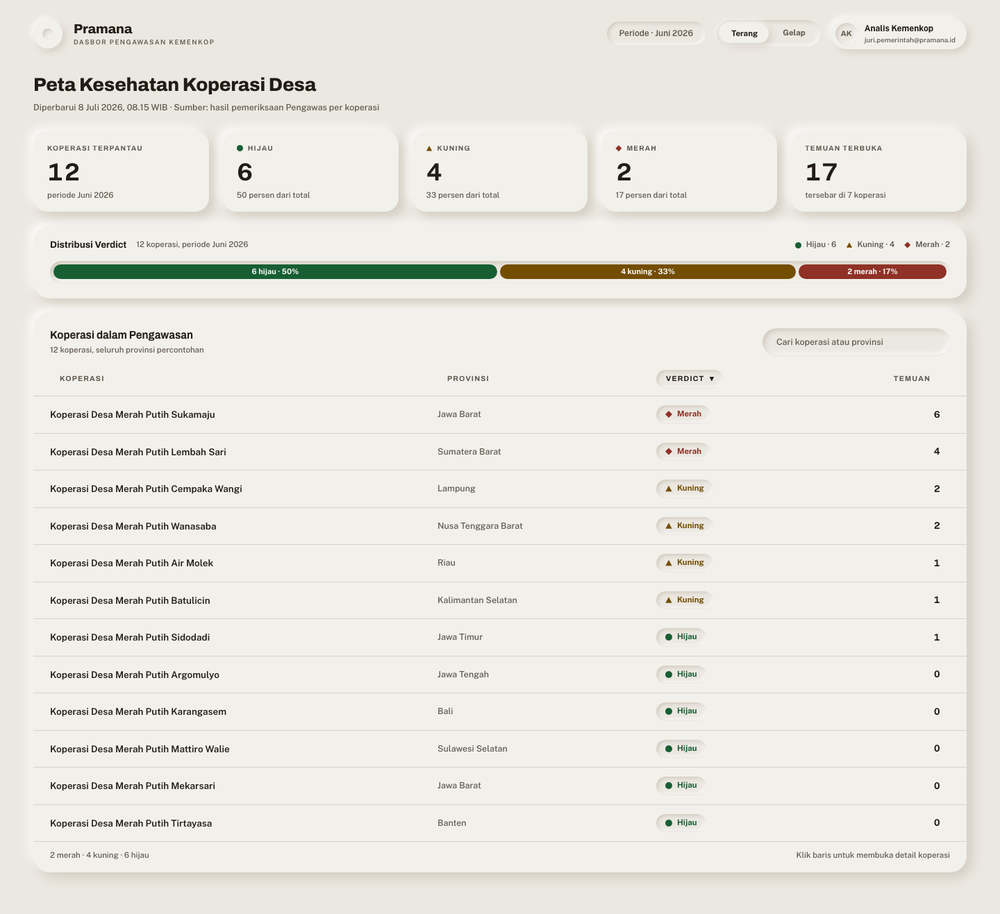

<!--
  Skeleton pitch deck Pramana AI (kontrak 6.11). Dua belas slide, H1 beku.
  Bullet di bawah adalah placeholder ringkas; konten penuh dan polish visual
  diisi Phase 8. Angka nasional disalin sebagai teks dari lib/facts.ts, sumber
  dan tanggal ada di footnote tiap slide. Register 6.8: sapaan "Anda", tanpa
  em dash, tanpa emoji.
-->

# Pramana AI

Pengawas koperasi desa, di genggaman setiap anggota.

- Tim Daulat, Politeknik Negeri Bandung
- Tema: Keterlibatan Masyarakat dalam Berkoperasi

---

# Masalah

- Dana besar mengalir ke koperasi desa, pengawasannya belum menyusul.
- 83.383 koperasi desa Merah Putih terbentuk; baru 50.383 melaksanakan RAT.
- Perkiraan risiko kebocoran sekitar Rp60 juta per unit per tahun.
- Pengawas anggota sering tinggal formalitas.

> Sumber: Simkopdes via Katadata (29 Juni 2026); Studi CELIOS (2026).

---

# Wawasan

- Anggota adalah pemilik sah, tetapi tidak punya alat untuk mengawasi.
- Aplikasi lain melayani pengurus, sehingga secara struktural tidak mungkin mengawasi pengurus.

---

# Solusi

- Pengawas AI yang bekerja untuk anggota, bukan untuk pengurus.
- Verdict hijau, kuning, merah dengan bentuk dan label, bukan warna saja.
- Prinsip inti: bertanya, bukan menuduh.

---

# Cara Kerja

- Empat agen pemeriksa berjalan paralel, lalu satu adjudikator.
- Keluaran: verdict dan daftar pertanyaan untuk Rapat Anggota Tahunan.
- Tiap agen memeriksa tipologi nyata: konflik kepentingan, anomali transaksi, kesehatan finansial, kepatuhan proses.

---

# Demo: Temuan

- Contoh AN-1: pembelian ke Toko Berkah Rp15 juta, alamat sama dengan rumah bendahara.
- Bahasa awam, bukti transaksi, dan satu pertanyaan siap dibawa ke rapat.

---

# Demo: Dari Temuan ke Rapat

- Layar Suara Anda: pertanyaan yang sama diajukan banyak anggota.
- RAT berubah dari seremoni menjadi pengawasan yang nyata.

---

# Dua Antarmuka

 

- Beranda anggota di ponsel, dasbor pemerintah di desktop.
- Satu basis kode, empat permukaan berbeda register visual.

---

# Dampak

- Anggota berdaya untuk bertanya dengan bukti.
- Pengurus yang jujur terbukti bersih.
- Pemerintah melihat peta kesehatan koperasi tiap minggu.

---

# Implementasi

- Menumpang data SIMKOPDES pada fase produksi.
- Stack ringan, mode demo anti-gagal dari data seed.
- Roadmap dua fase: API MiniMax sekarang, model open-weight on-premise sesuai UU PDP untuk produksi.

---

# Penggunaan AI (Disclosure)

- Gagasan inti orisinal Tim Daulat, terdokumentasi sebelum pembangunan.
- AI sebagai alat: Claude Opus 4.8 via Claude Code untuk implementasi.
- AI sebagai mesin runtime produk: MiniMax-M2.7. Rincian di DISCLOSURE-AI.md.

---

# Penutup

- URL demo: https://pramana-ai-puce.vercel.app
- Kredensial juri tersedia di halaman masuk dan README.
- Repositori publik: https://github.com/Finerium/pramana-ai
- Pramana bertanya, tidak menuduh. Silakan coba.
